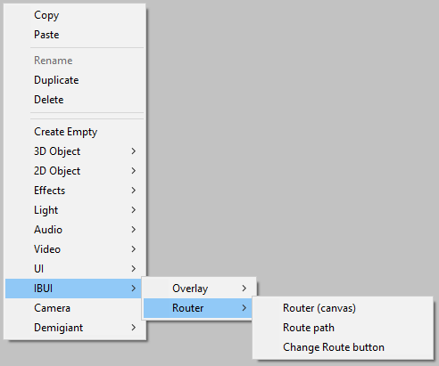
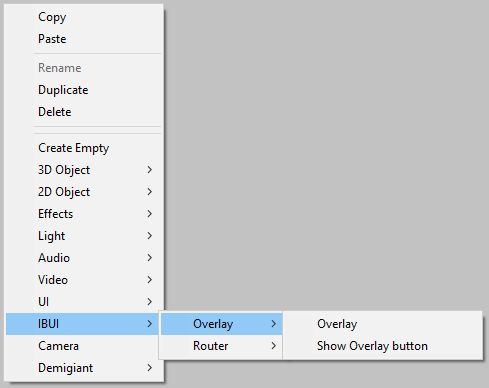

# Quick-start guide {#quick-start}

This library contains some components that has been added to the Unity context
menu, to make it easy to get started. This section contains a brief introduction
to the various components, and how they are meant to be used together.

In the following examples, it is assumed that the scene in Unity already
contains an instance of an event system, which is needed for a user to actually
interact with the UI.

## Router quick-start

The router is basically a state manager, which keeps a string-based state. As
such, it can be compared to the URL of a website: *www.example.com/todos* may
point to the *todos*-page, and *www.example.com/todos/123* may point to the
specific todo with id *123*, and show it on that page. With the IBUI router, you
can (and probably should) completely skip the domain-part of a URL though, and
just use states like *todos* and *todos/123*.

The IBUI router is inspired by React Router. In order to use the router, you
need a [Router](#router) object as parent to one or more
[Route path](#route-path) objects. In order to actually change from one route to
another, you need some [Change Route Button](#change-route-button)s.

Besides the current state, the router also keeps track of the history. This
resembles the history of a browser, i.e. the functionality behind the *back* and
*forward* buttons in the browser. The **Change Route button** has different
action-types, that manipulate the history in different ways. The various actions
are as follows:
- **Push**: Go to a specified state, pushing it as the newest state. This allows
  the user to go back to the original page (from where the button was pressed).
- **Change**: Exchange the current state with another specified state. This
  means that the user can't go back to the current page, but would instead go
  back to the previous page from the current one.
- **Set**: Clear the entire history, and go to a specified state. This is
  helpful if the user wants to start over in the menu.
- **Pop**: Go back one step in the history.

As an example, create the following hierarchy:
- Router
  - Route path: "default"
    - Change route button: [push] "start-game"
    - Change route button: [push] "options"
  - Route path: "start-game"
    - Change route button: [pop]
  - Route path: "options"
    - Change route button: [pop]

In the following sections, you can read a more detailed explanation of the
various menu-items in the Router-menu.

### Router (canvas) {#router}

The Router-option creates a new GameObject that resembles a Canvas from the
Unity UI. As such, it has the following Unity components:

- Rect Transform
- Canvas
- Canvas Scaler
- Graphic Raycaster

On top of this, it has the IBUI [Router](DEFAULT-IMPLEMENTATION.md#Router)
component.

The Router should be the parent to multiple Route Paths, and acts as the state
manager for the menu system. It is possible to have multiple Routers in the same
scene, but it is not currently possible to have nested routers.

### Route path {#route-path}

The Route Path-option creates a new GameObject with the Rect Transform
component, as well as the following IBUI components:

- [Route Path](DEFAULT-IMPLEMENTATION.md#Route-Path)
- [Activatable](DEFAULT-IMPLEMENTATION.md#Activatable)
- [Showable](DEFAULT-IMPLEMENTATION.md#Showable)
- [Focus First With Priority](DEFAULT-IMPLEMENTATION.md#Focus-First-With-Priority)
- [Slide In Out](DEFAULT-IMPLEMENTATION.md#Slide-In-Out)

The Route Paths should be children (or other descendents) of a Router
GameObject. All Route Path under a Router will react to state changes from that
Router.

### Change Route button {#change-router-button}

The Change Route button creates a button similar to a Unity UI button. As such,
it creates a GameObject with the following Unity components:

- Rect Transform
- Canvas Renderer
- Image
- Button

It also creates a child GameObject with the following Unity components:

- Rect Transform
- Canvas Renderer
- Text Mesh Pro UGUI

The created GameObject also has the IBUI
[Change Route button](DEFAULT-IMPLEMENTATION.md#Change-Route-button) component,
which interacts with the Router to change the state.

## Overlay quick-start

TODO: Describe the overlay

## Overlay

TODO: Describe the Overlay

## Show Overlay button

TODO: Describe the Show Overlay button
